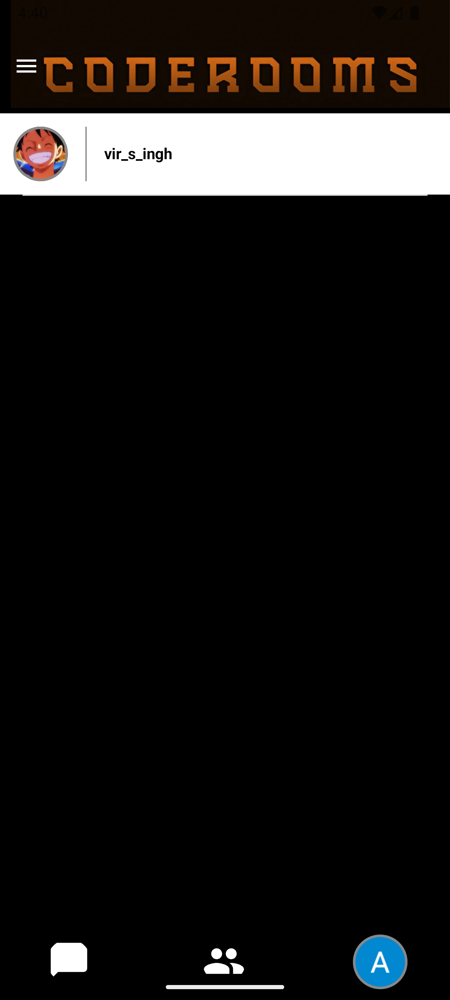
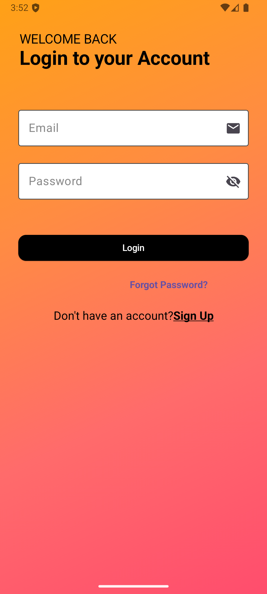
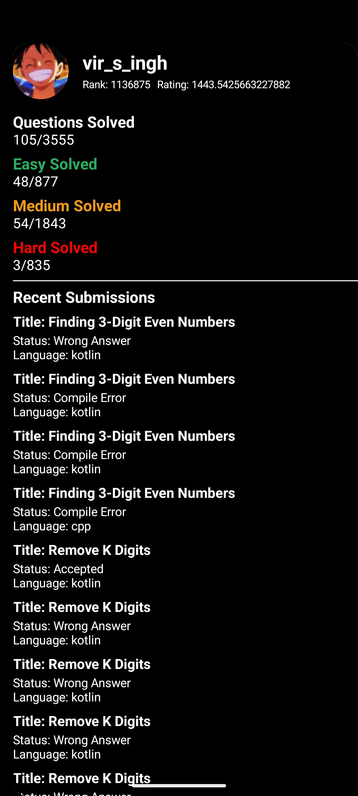

# Codesgram

Codesgram is a modern Android app that brings together coding enthusiasts to chat, collaborate, and track their LeetCode progress—all in one place. With real-time chat, user profiles, and deep LeetCode integration, Codesgram is perfect for students, interview preppers, and anyone passionate about coding.

---

## Table of Contents

- [Features](#features)
- [Screenshots](#screenshots)
- [Architecture](#architecture)
- [User Flow](#user-flow)
- [LeetCode Integration](#leetcode-integration)
- [Tech Stack](#tech-stack)
- [Setup & Installation](#setup--installation)
- [Roadmap](#roadmap)
- [Contributing](#contributing)
- [License](#license)
- [Contact](#contact)

---

## Features

### 🔒 Authentication & Onboarding
- Google Sign-In with Firebase Authentication
- Onboarding flow that prompts for LeetCode username and creates a user profile

### 💬 Real-Time Chat
- **Personal Chat:** One-on-one messaging with other users
- **Group Chat:** You will automatically get joined in a group chat according to your coding level- Beginner, Intermediate or Expert based on your leetcode stats
-  Messages are stored and synced in real-time using Firebase Realtime Database
- Toast notifications for message status

### 👤 User Profiles
- Each user has a profile with avatar, email, and LeetCode stats
- Profiles are stored in Firebase and updated on sign-in

### 📊 LeetCode Stats & Progress
- Fetches and displays detailed LeetCode stats: total solved, rank, contest rating, recent submissions, and more
- Visualizes progress by difficulty (Easy/Medium/Hard)
- Shows recent submissions and contest history

### 🖥️ Modern UI
- Built with Jetpack Compose for a smooth, responsive experience
- Dark mode and visually appealing layouts

---

## Screenshots

<!-- Add screenshots of your app here -->
<p align="center">
  
  
  
  <!-- Add more screenshots as needed -->
</p>

---

## Architecture

Codesgram uses a robust, scalable architecture:

- **MVVM Pattern:** Separation of UI, business logic, and data
- **Jetpack Compose:** Declarative UI framework
- **Firebase:** Authentication, Realtime Database for chat and user data
- **Retrofit:** For RESTful API calls to LeetCode endpoints
- **Repository Pattern:** Abstracts data sources (network, database)
- **ViewModels:** Manage UI-related data and handle business logic

<details>
<summary>Architecture Diagram (textual)</summary>

```
[UI (Jetpack Compose)]
      |
[ViewModel (LeetCodeStatsViewModel, UserProfileViewModel)]
      |
[Repository (LeetCodeRepository)]
      |
[Remote API (LeetCodeApiService)]   [Firebase (Auth, Realtime DB)]
```
</details>

---

## User Flow

1. **Sign In:** User authenticates via Google
2. **Onboarding:** User enters LeetCode username (if first time)
3. **Home:** User lands on chat or group chat screen
4. **Profile:** User can view/edit their profile and see LeetCode stats
5. **Chat:** User can send/receive messages in real-time (personal or group)
6. **LeetCode Stats:** User can view their coding progress, recent submissions, and contest ratings

---

## LeetCode Integration

- Uses a custom backend proxy to fetch LeetCode data securely
- Endpoints include: user profile, badges, solved problems, contest details, submissions, language stats, and more
- Data is fetched using Retrofit and displayed in real-time in the app

---

## Tech Stack

- **Kotlin** (primary language)
- **Jetpack Compose** (UI)
- **Firebase Auth & Realtime Database** (backend)
- **Retrofit** (networking)
- **MVVM Architecture**
- **Coil** (image loading)
- **Material 3** (design system)

---

## Setup & Installation

1. **Clone the repository:**
   ```bash
   git clone https://github.com/yourusername/Codesgram.git
   ```
2. **Open in Android Studio:**
   - Open Android Studio
   - Select `Open an existing project` and choose the cloned folder
3. **Configure Firebase:**
   - Add your `google-services.json` to `app/`
   - Set up Firebase Auth and Realtime Database in the Firebase console
4. **Build the project:**
   - Let Gradle sync and build the project
5. **Run the app:**
   - Connect your Android device or use an emulator
   - Click the Run button

---

## Roadmap

- [ ] Add push notifications for new messages
- [ ] Support for code sharing in chat
- [ ] More detailed LeetCode analytics
- [ ] In-app friend requests and group management
- [ ] UI/UX enhancements

---

## Contributing

Contributions are welcome! Please open an issue or submit a pull request for any improvements or bug fixes.

---

## License

This project is licensed under the MIT License. See the [LICENSE](LICENSE) file for details.

---

## Contact

For questions or feedback, please contact [your-email@example.com].

---

Would you like me to save this as your new README? If you want to add or change anything, let me know!
